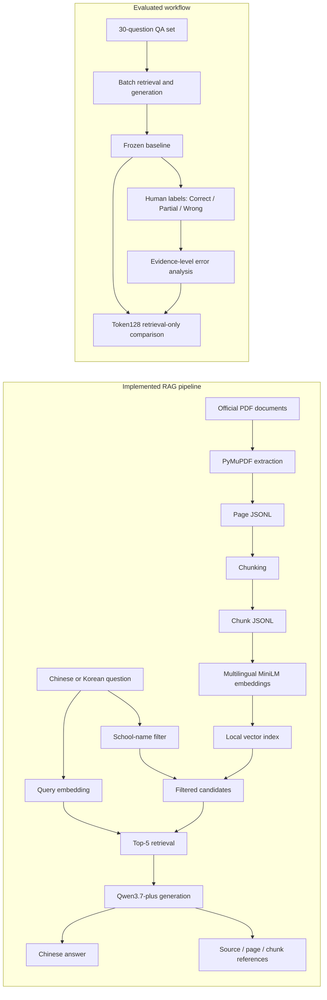

# Multilingual RAG for Korean University Administrative Documents

## Project Overview

This project explores how retrieval-augmented generation can make Korean university administrative documents easier to use. Rules about degree requirements, course registration, leave and return procedures, scholarships, thesis review, and immigration paperwork are often spread across Korean-language PDFs with inconsistent layouts, making them difficult for international students to search and compare.

The working pipeline accepts Chinese or Korean questions, retrieves evidence from a local document collection, and produces a Chinese answer with source, page, and chunk references. It has been evaluated as a research prototype and has not been deployed. Third-party documents, reconstructable full text, model caches, embeddings, and raw experiment logs are kept outside the public release boundary.

## Project Status

| Status | Scope |
| --- | --- |
| **Implemented** | PDF extraction, chunking, multilingual embeddings, vector retrieval, school filtering, Chinese answer generation, and evidence references |
| **Evaluated** | A frozen 30-question Chinese/Korean baseline, human review, error analysis, and a retrieval-only Token128 experiment |
| **Planned** | Thesis experiments on chunking, table structure, cross-language retrieval, evidence coverage, and citation verification |
| **Future** | Chinese-Korean-English-Italian expansion, official web-source updates, stronger provenance, and production engineering |

## Implemented Features

- PDF text extraction with PyMuPDF and page-level provenance.
- Character-based chunking and local JSONL artifacts.
- 384-dimensional normalized embeddings from `sentence-transformers/paraphrase-multilingual-MiniLM-L12-v2`.
- Top-5 vector retrieval using normalized dot-product similarity.
- Query-time filtering for five universities when a supported Chinese or Korean school name appears in the question.
- Chinese and Korean question input; answers are generated in Chinese.
- Evidence-grounded answer generation with `qwen3.7-plus` through the DashScope OpenAI-compatible API.
- References mapped from model-selected evidence IDs to source file, page number, and chunk ID.
- Offline scoring and diagnostic scripts for retrieval, citations, and manually reviewed answers.

The reference mechanism records where each selected passage came from. It does not guarantee that a citation supports every statement in the generated answer; the error analysis found both incomplete evidence and incorrect interpretation.

## Architecture



## Examples from the Frozen Baseline

The examples below are unchanged records from the 30-question evaluation. They include two Correct answers and one failed refusal so that the current limitations remain visible.

| ID | Input | Frozen system output | Human label |
| --- | --- | --- | --- |
| Q01-ZH | 西江大学研究生外语考试什么时候可以参加？ | 西江大学研究生外语考试每学期举行一次，分别在3月和9月进行。学生可以从各学位课程修读的第一个学期开始参加考试，但必须在学位论文审查之前通过考试。 | Correct |
| Q11-KO | 이화여자대학교 대학원생은 졸업하려면 총 평균평점이 최소 얼마 이상이어야 하나요? | 梨花女子大学研究生院学生毕业时，总平均绩点必须至少为3.0以上。 | Correct |
| Q05-KO | 한국외국어대학교 외국인 유학생이 비자 연장을 신청할 때 어떤 서류가 필요한가요? | 无法从现有文档中确认。 | Wrong — target evidence ranked 7th and was outside Top-K=5 |

The exact citations and review notes are in [`docs/demo_examples.md`](docs/demo_examples.md). Q05-KO is presented as a retrieval failure, not as a successful abstention.

## Technology Stack

| Component | Used in this project |
| --- | --- |
| Language | Python 3.11.0 in the audited experiment environment |
| PDF extraction | PyMuPDF |
| Data processing | Python, JSONL, and NumPy |
| Embeddings | sentence-transformers; `paraphrase-multilingual-MiniLM-L12-v2` |
| Retrieval | Normalized NumPy dot product, Top-K=5, school-name filtering |
| Generation | `qwen3.7-plus` via DashScope's OpenAI-compatible endpoint |
| Configuration | `python-dotenv` and a local `.env` file |
| Evaluation artifacts | JSON, JSONL, CSV, Markdown, and XLSX summaries |

Direct dependency versions are pinned in [`requirements.txt`](requirements.txt). The complete audited Python 3.11 environment, including transitive packages and the CPU-only PyTorch runtime, is recorded in [`requirements-lock-py311.txt`](requirements-lock-py311.txt).

## Evaluation

The frozen baseline contains 30 questions: 15 in Chinese and 15 in Korean. Answers were manually assigned one of three labels. `Partial` is not counted as correct in strict accuracy.

| Set | Questions | Correct | Partial | Wrong | Strict accuracy |
| --- | ---: | ---: | ---: | ---: | ---: |
| All | 30 | 13 | 7 | 10 | **43.33%** |
| Chinese questions | 15 | 9 | 2 | 4 | 60.00% |
| Korean questions | 15 | 4 | 5 | 6 | 26.67% |

These labels measure answer quality, not retrieval Hit@5 or the script's `supported` field. The evaluation also revealed Gold-data problems:

- Q14 used doctoral credit requirements as the expected answer to a master's question; the source table supports a 24-credit master's major-course requirement.
- The graduate-student applicability of the evidence used for Q04 and Q15 is not yet confirmed by the frozen corpus.
- In Q08, Korean `2월 중 / 8월 중` means during February/August and does not by itself mean the middle of those months.

The original Gold answers, baseline outputs, and human labels remain frozen. Corrections and applicability questions are recorded separately so that the reported baseline does not change after review. See the [baseline summary](data/evaluation/baseline_summary.md), [Gold adjudication notes](data/evaluation/gold_issues_and_adjudication.md), and [error-analysis report](data/evaluation/error_analysis/error_analysis_report.md).

## Negative Experiment: `token128_clause_v1`

The production chunks were created with a 500-character window and 100-character overlap, while the embedding model accepts at most 128 tokens. A separate clause-oriented experiment attempted to remove this mismatch without changing the model, school filter, or Top-K.

| Retrieval diagnostic | Before | After |
| --- | ---: | ---: |
| Chunks above the 128-token embedding limit | 253 / 331 | 0 / 922 |
| Valid target-fact Hit@5 | 51 / 78 | 18 / 78 |
| Questions with complete coverage of all registered valid facts | 9 / 22 | 3 / 22 |

The experiment preserved 100% of the available extracted body text and eliminated over-limit embedding inputs. Retrieval quality still declined sharply: lists and multi-part conditions were split across too many chunks, short headings occupied retrieval positions, and inherited context was sometimes misleading. Eight of the 13 previously Correct questions lost at least one registered evidence fact.

The new index was therefore **not adopted**. These numbers are retrieval and evidence-coverage measurements; no paid LLM was run, and they are not answer-accuracy results. The complete conclusion is in the [Token128 final report](data/experiments/token128_clause_v1/evaluation/final_report.md).

## Main Findings

1. **Silent token truncation matters.** In the production index, 253 of 331 chunks exceeded the model's 128-token input limit. Relevant facts could exist in stored text without contributing to the embedding.
2. **Shorter chunks can reduce evidence completeness.** The Token128 experiment removed truncation but split long lists and linked conditions across too many retrieval units for Top-K=5.
3. **PDF table extraction loses relationships.** Merged cells and column spans in degree-requirement tables were flattened, causing master's, doctoral, and combined-program values to be associated with the wrong degree type.
4. **Cross-language retrieval is uneven.** The manually reviewed baseline was stronger for Chinese questions than Korean questions, and individual evidence ranks differed substantially across the paired queries.
5. **A citation pointer is not proof of support.** Correct source metadata can accompany an unsupported number, missing condition, or scope mismatch.

## Reproducibility

The audited experiments used Python 3.11.0. Create an isolated Python 3 environment and install the declared dependencies:

```bash
python -m venv .venv
# Activate the environment for your operating system, then run:
python -m pip install -r requirements.txt
```

Answer generation and batch QA evaluation require a local environment variable:

```text
DASHSCOPE_API_KEY=your_own_key
```

Store it in `.env`; real environment files are ignored. Generation and evaluation can incur API charges. Retrieval is local after the corpus, embeddings, and model files are available, although sentence-transformers may download the model when it is absent from the cache.

This public project is **not self-contained or ready to run immediately**. Copyright-sensitive source PDFs, extracted full text, production embeddings, raw QA records, and complete retrieval logs are excluded. Users must obtain documents lawfully and rebuild local artifacts before running the pipeline.

The main entry points are:

| Stage | Command | Important side effect |
| --- | --- | --- |
| Extract | `python scripts/1_extract_documents.py` | Rewrites `data/processed/pages.jsonl` |
| Chunk | `python scripts/2_chunk_documents.py` | Rewrites `data/processed/chunks.jsonl` |
| Embed | `python scripts/3_build_embeddings.py` | Rewrites production embedding artifacts |
| Single retrieval | `python scripts/5_single_retrieve.py` | Reads the local chunks and index |
| Batch retrieval | `python scripts/5_batch_retrieve.py` | Rewrites the configured retrieval-results file |
| Generate an answer | `python scripts/5_generate_answer.py` | Calls the paid-capable external API |
| Batch QA evaluation | `python scripts/6_evaluate_qa.py` | Calls the API and rewrites evaluation results |
| Score results | `python scripts/7_score_evaluation.py` | Rewrites score and summary outputs |

Several baseline scripts use normal write mode. Do not run them inside an archival experiment directory without first checking their configured output paths. The versioned Token128 scripts use separate directories and refuse to overwrite completed artifacts.

## Research Roadmap — Planned Thesis Work

The thesis stage will use controlled, versioned comparisons:

1. Adjudicate Gold answers, applicability scope, translations, and evidence locations before changing retrieval.
2. Build a table-aware representation that preserves degree type, year range, headers, merged-cell relationships, and footnotes.
3. Compare chunking strategies under the same embedding model and Top-K, using target-fact Hit@5, complete evidence coverage, school/scope match, and regression on previously correct cases.
4. Evaluate Chinese and Korean paired queries separately to isolate cross-language ranking differences.
5. Test retrieval changes before running generation; then measure answer correctness, condition preservation, abstention, and statement-level citation support.
6. Freeze configurations and evidence mappings before each After run and report negative results alongside improvements.

These experiments are planned and have not yet been completed.

## Future Research

The following items are longer-term directions, not current features:

- Extend querying and answer evaluation across Chinese, Korean, English, and Italian.
- Add versioned ingestion from official university web pages with update detection and provenance records.
- Estimate evidence reliability using source authority, publication date, applicability scope, and statement-level support.
- Develop incremental indexing, reproducible data lineage, monitoring, access control, and deployment safeguards.
- Study when the system should abstain or route a question to a university administrative office.

## Contributions and AI Assistance

Work on the project has included organizing the university-document corpus, implementing and running the RAG pipeline, building the bilingual QA evaluation, reviewing all 30 answers against source evidence, carrying out the error analysis, and designing the Token128 comparison. The regressed index was kept as a negative result instead of replacing the existing index.

AI tools assisted with parts of the code and diagnostic-script drafting, debugging, and documentation. AI-assisted outputs were reviewed before use; source selection, factual checks, manual evaluation, experiment design, interpretation, and release decisions remained human decisions. Qwen3.7-plus is also the answer-generation model used in the frozen baseline.

## Limitations

- The corpus covers a small set of documents from five Korean universities and is not a complete policy source.
- Some frozen questions rely on evidence whose graduate-student applicability remains unresolved.
- PDF extraction does not preserve all table structure or visual relationships.
- The baseline has 30 questions and a single assisted human-review process; it is not a statistically comprehensive benchmark or an inter-annotator agreement study.
- School filtering depends on an explicit Chinese or Korean alias in the query.
- The current generator may omit conditions, misattribute numbers, abstain incorrectly, or select citations that do not fully support its answer.
- No online demo, production deployment, automated source updating, or four-language pipeline has been implemented.

## Data Policy

The university documents are third-party official materials. Their copyright is not claimed here, and the publication boundary does not include the source PDFs or reconstructable full text. Model caches, embeddings, detailed QA records, full retrieval outputs, local environment files, and internal work materials are also excluded.

Public evaluation files contain reviewed summaries and aggregate results. Any future release of QA rows or short source excerpts requires a separate copyright, attribution, and privacy review. Reproduction should use documents obtained from their official sources under applicable terms.

## License

Original project code is copyright © 2026 Guangyuan Yuan and licensed under the [GNU Affero General Public License v3.0 only](LICENSE) (`AGPL-3.0-only`). The license does not cover third-party dependencies, model or tokenizer weights, external model services, or university documents. See the project [NOTICE](NOTICE), [Third-Party Notices](docs/THIRD_PARTY_NOTICES.md), and [Third-Party Data Notice](docs/third_party_data_notice.md) for the applicable boundaries.

## Repository Navigation

| Path | Contents | Status |
| --- | --- | --- |
| [`scripts/`](scripts/) | Core pipeline and versioned experiment scripts | Implemented |
| [`configs/chunking/token128_clause_v1.json`](configs/chunking/token128_clause_v1.json) | Frozen negative-experiment configuration | Evaluated; not adopted |
| [`tests/test_token128_chunking.py`](tests/test_token128_chunking.py) | Invariant tests for the Token128 experiment | Evaluated |
| [`data/evaluation/baseline_summary.md`](data/evaluation/baseline_summary.md) | Frozen 30-question human-score summary | Evaluated |
| [`data/evaluation/error_analysis/error_analysis_report.md`](data/evaluation/error_analysis/error_analysis_report.md) | Evidence-level diagnosis of all Partial/Wrong cases | Evaluated |
| [`data/experiments/token128_clause_v1/evaluation/final_report.md`](data/experiments/token128_clause_v1/evaluation/final_report.md) | Before/After retrieval results and regressions | Evaluated; negative result |
| [`docs/demo_examples.md`](docs/demo_examples.md) | Three unchanged examples from the frozen baseline | Published; locally reviewed |
| [`docs/github_release_preview.md`](docs/github_release_preview.md) | Publication allowlist and safety boundary | Published release record |

